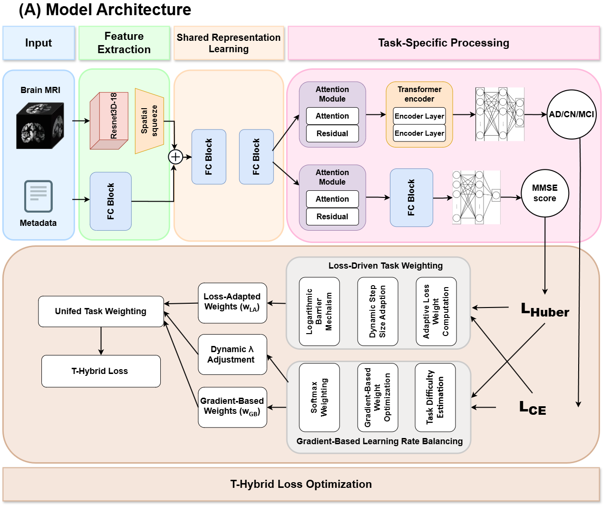

# Optimizing Multi-Task Learning for Alzheimer's Diagnosis and MMSE Score Prediction

This repository contains the official implementation of the paper:

**"Optimizing Multi-Task Learning for Alzheimer’s Stage Classification and MMSE Score Prediction with Enhanced Frank-Wolfe and GradNorm"**

## 🧠 Overview

We propose a novel **Enhanced Frank-Wolfe with GradNorm** algorithm to dynamically balance loss across tasks in **Multi-Task Learning (MTL)** for Alzheimer's disease diagnosis. Our model performs two tasks simultaneously:

1. **Alzheimer's Stage Classification**: Classifies MRI images into three stages: *AD (Alzheimer's Disease)*, *MCI (Mild Cognitive Impairment)*, and *CN (Cognitively Normal)*.
2. **MMSE Score Prediction**: Predicts the Mini-Mental State Examination (MMSE) score from MRI and demographic data.

### Model Architecture

The model is built upon a **3D-ResNet18** backbone to process MRI data combined with demographic information (age, gender). The proposed **Enhanced Frank-Wolfe with GradNorm** algorithm dynamically adjusts task-specific loss weights during training.



## 📊 Results

Our approach significantly outperforms existing methods in both accuracy and RMSE:

| Task                      | Accuracy (%) | RMSE   |
|---------------------------|--------------|--------|
| Alzheimer's Classification | **98.81**   | -      |
| MMSE Score Prediction      | -           | **0.99** |


## 📁 Repository Structure

```
.
├── architecture.png     # Model architecture diagram
├── results.png          # Experimental results
├── dataset/             # Data loading scripts
├── models/              # Model definition (ResNet3D + Enhanced Frank-Wolfe + GradNorm)
├── train.py             # Main training script
├── evaluate.py          # Evaluation script
└── README.md            # Project description
```

## 🚀 Installation

1. Clone the repository:

```bash
git clone https://github.com/yourusername/alzheimer-mtl.git
cd alzheimer-mtl
```

2. Set up the environment:

```bash
python -m venv env
source env/bin/activate  
pip install -r requirements.txt
```

## 🔨 Usage

### 1. Prepare the dataset
Ensure your MRI images and demographic data are organized as follows:

```
dataset/
├── train/
│   ├── mri/         # MRI images
│   └── metadata.csv # Demographic information (age, gender, MMSE)
└── test/
```

### 2. Train the model

```bash
python train.py --epochs 100 --batch_size 8 --lr 0.001
```

### 3. Evaluate the model

```bash
python evaluate.py --checkpoint path/to/checkpoint.pth
```

## 📌 Citation

If you use this work, please cite our paper:

```
@article{your_paper,
  title={Optimizing Multi-Task Learning for Alzheimer’s Stage Classification and MMSE Score Prediction with Enhanced Frank-Wolfe and GradNorm},
  author={Your Name, Co-authors},
  journal={Your Journal},
  year={2025}
}
```

## 📧 Contact
For questions or collaborations, feel free to reach out:
- **Email**: 21520485@gm.uit.edu.vn
- **GitHub**: [Hissatsu265](https://github.com/Hissatsu265)

---

⭐ **If you find this work useful, please give a star!**

